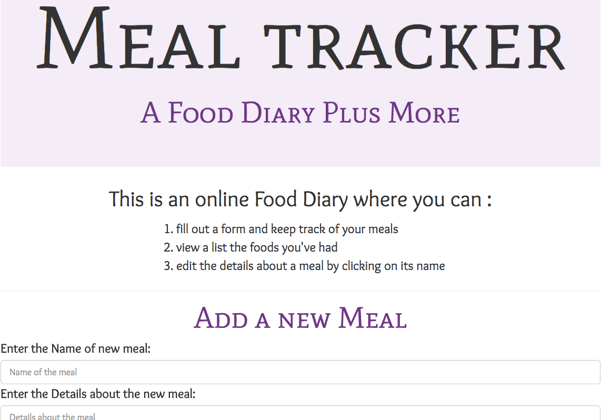
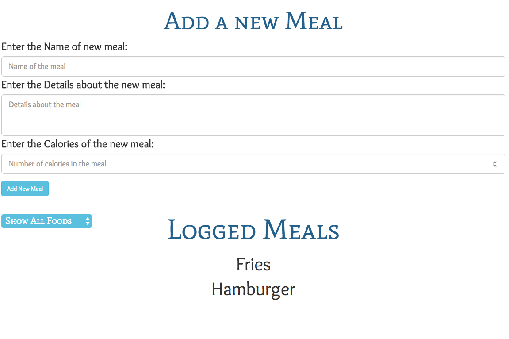
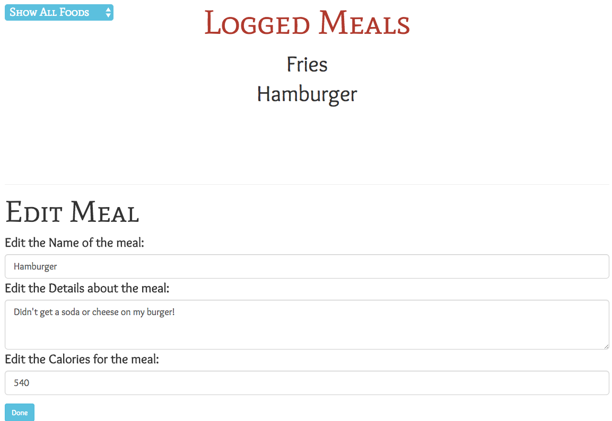

# Meal Tracker
## This is a meal tracking web application. The user can input the name of the food, details about the food and its amount of calories, 15/09/2017

## By **[Carol Wanjohi](https://github.com/carolwanjohi)**

## Description

This is a meal tracking web application. The user can input the name of the food, details about the food and its amount of calories. This information is filled in a form and submitted by clicking on the **Add New Meal** button. 

This information is stored in a list which contains the meals logged by the user.  
The list has the following display options:
* All the meals (this is the default list)
* High calorie meals
* Low calorie meals

The user can also click on a food name to edit its name, details or calories (in case the user decided to pretend their fries were 100 calories instead of 365).

## User Stories
As a user, ...
* I want to log food I have eaten by submitting a form with food name, calories and details.
* I want to view a list of foods I have logged.
* I want options to view all foods, only high-calorie foods (more than 500 calories), or only lower-calorie foods (less than 500 calories).
* I want to click a food to edit its name, details or calories (in case I decide to pretend my fries were 100 calories instead of 365).

## Setup/Installation Requirements

* You can also **clone this repo**. 
  * You will need to **run npm install and bower install** for the dependancies. For the commands to work you need **node and npm installed** on your machine.

## Known Bugs

No known bugs

## Technologies Used

- HTML
- SCSS
- Node packages
- Bower packages
- Angular 2
- TypeScript
- TypeScript Compiler

### License

MIT (c) 2017 **[Carol Wanjohi](https://github.com/carolwanjohi)**
